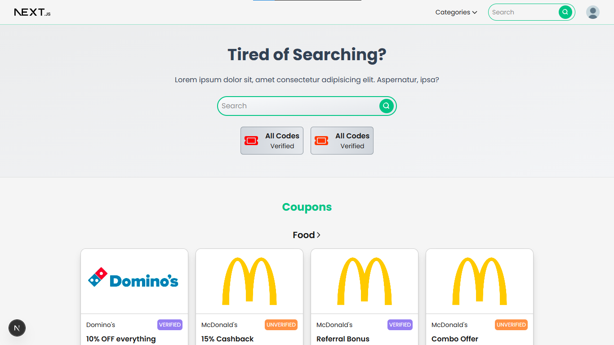
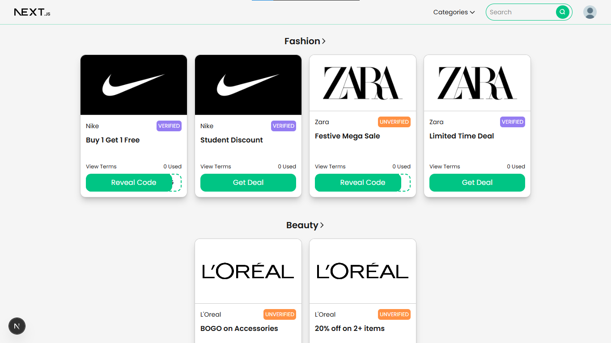
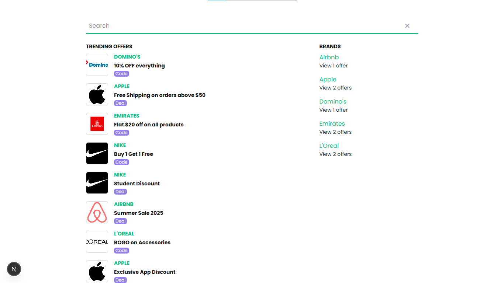
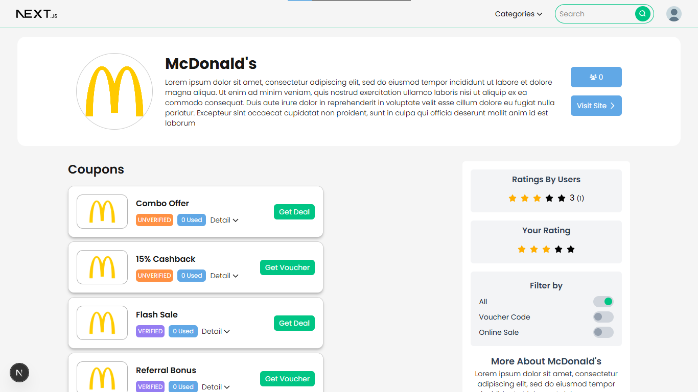
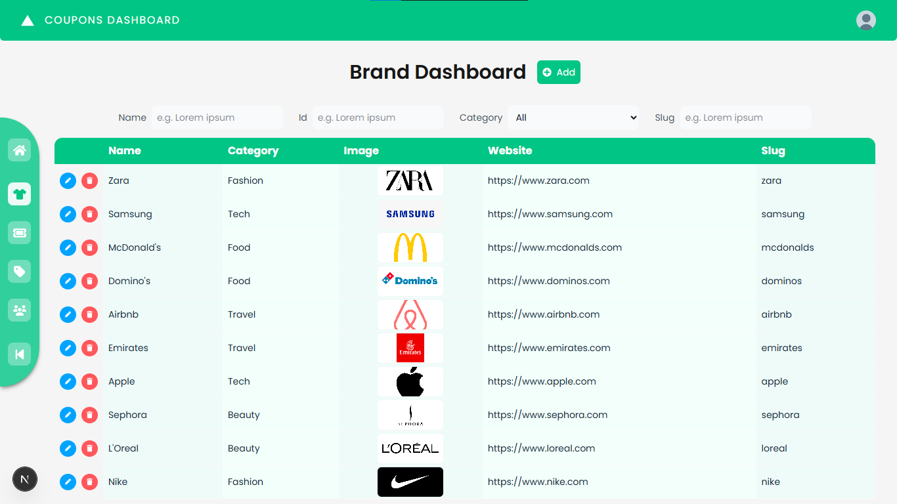
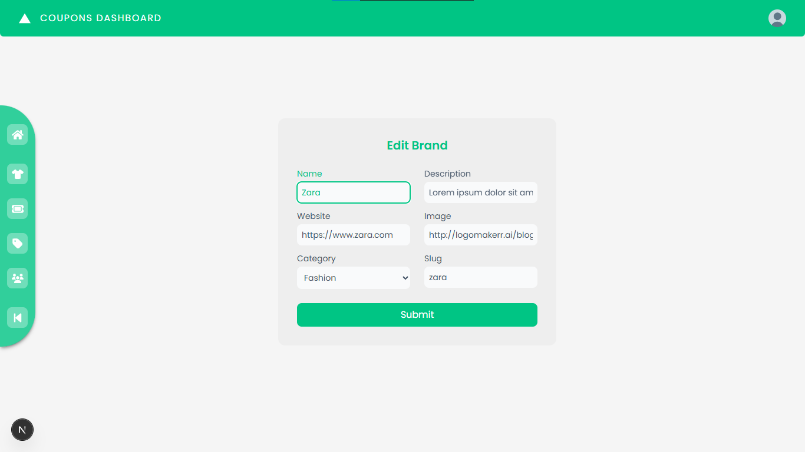
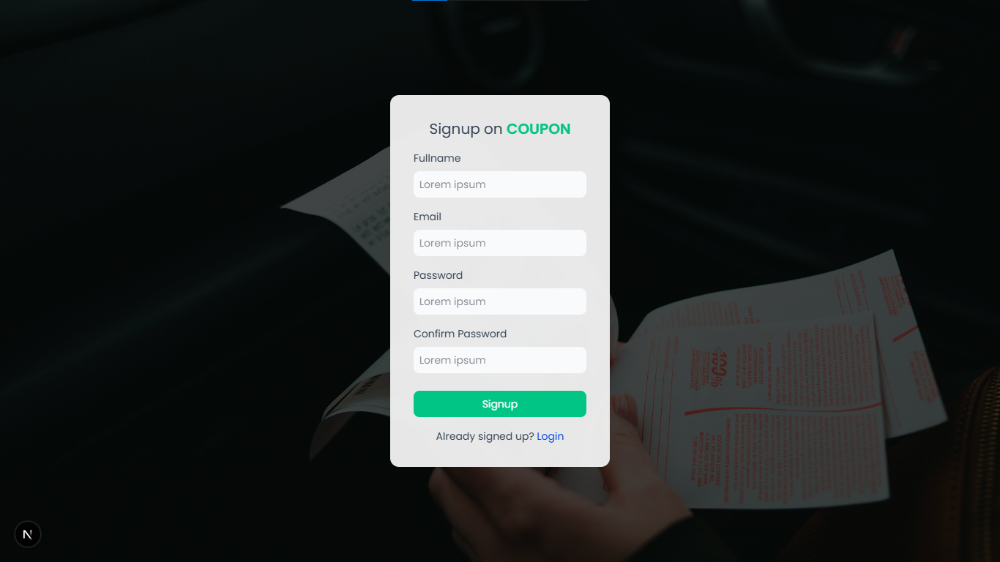

# Coupons Website Clone

### Features
- Coupons, Brands, Users, Categories
- Authentication, Dashboard
- Search, Coupon Usage Count, Brand Usage Count (based on IP)
- Max 2 Logins at a time based on IP and JWT tokens

### Screenshots

### Tech Stack
- Next.js
- Zustand
- Typescript
- MongoDB
- Express
- JWT
- Bcryptjs